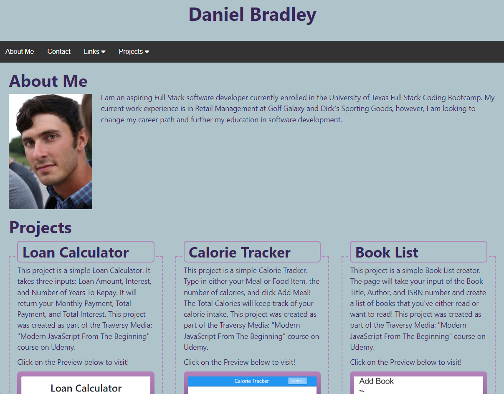

# Portfolio Webpage

## Description

This portfolio was created as a landing page for Daniel Bradley's projects, information, and contact. It houses my most important projects, links to my profiles, and a submission form to contact me with.

## Installation

N/A

## Usage

To use the Portfolio, go to the published webpage (https://dbradley555.github.io/Portfolio/). From there, you will be able to view preview images of my projects, navigate to my projects' webpages, access my LinkedIn and GitHub profiles, read about myself and my goals, and submit a contact request form with a message.

## Credits

N/A

## License

Please refer to the license in the repo.
